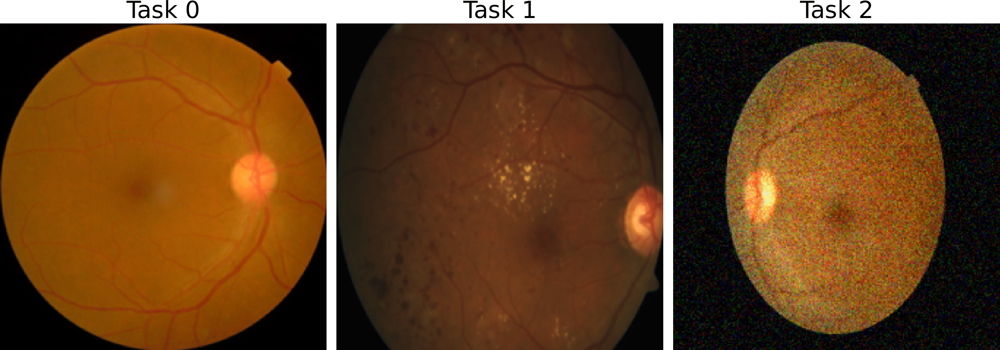
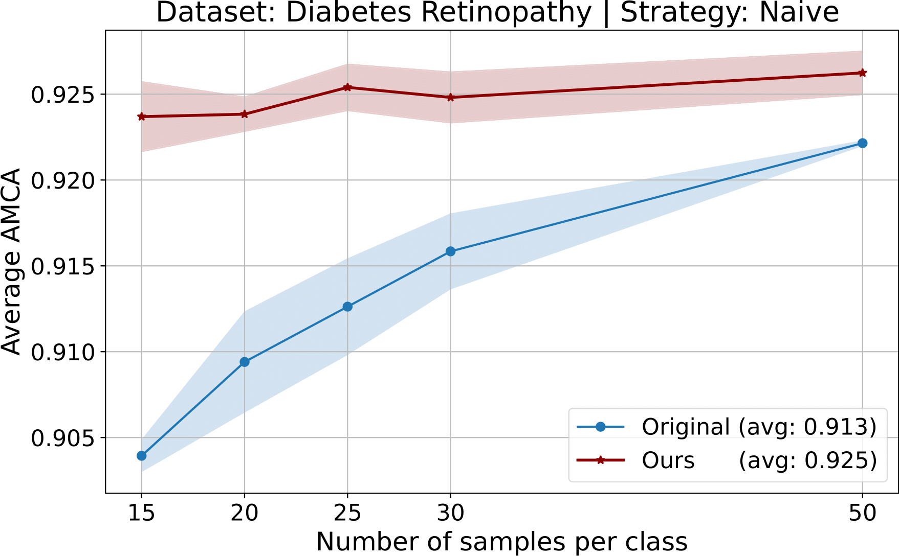
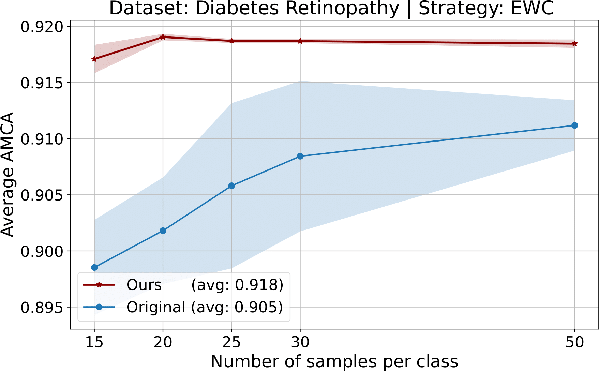
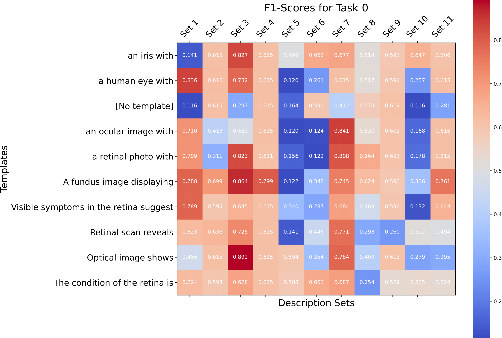

# Experience Replay and Zero-shot Clustering for Continual Learning in Diabetic Retinopathy Detection

## Introduction
Incremental learning, inspired by the adaptive nature of human learning, enables models to learn from a continuous stream of data, updating parameters with new information while retaining previously learned knowledge. Unlike conventional ML, which separates training and inference phases, incremental learning adapts to evolving real-world data and tasks. This approach is critical for maintaining consistent performance across changing multimodal data distributions, especially in medical imaging like diabetic retinopathy.

## Methodology
### Zero-shot Clustering with LLM and CLIP
- **Embedding Generation**: Use GPT-4 to generate textual descriptions and CLIP for visual and text embeddings.
- **Similarity and Clustering**: Cluster images based on cosine similarity between image and text embeddings.
- **Optimizing Description Selection**: Experiment with various templates and description sets to maximize classification performance.

### Stratified Sampling for Experience Replay
- **Sampling Procedure**: Ensure balanced representation of each class within the ER buffer by stratified sampling.
- **Experience Replay Algorithm**: Update the replay buffer with strategically sampled experiences to ensure effective learning and retention across tasks.

*Figure 1: Our method uses a Large Language Model (LLM) to generate descriptions $d_i$ for each image $x$, using metadata $m_i$ for initial domain learning in Task 0. These descriptions underpin unsupervised zero-shot clustering, forming clusters $x_i$. Key points from these clusters are buffered for replay. A multi-head classifier leverages this buffer in an Experience Replay (ER) strategy, learning the pertinent head $i$ for predictions $y$, thus preserving knowledge across successive tasks.*

## Experiments
### Experimental Setup
- **Testbed**: Ubuntu 22.04 LTS, dual Intel Xeon Platinum CPUs, 256 GB RAM.
- **Dataset**: APTOS 2019 Blindness Detection dataset with 3,662 retina images.
- **Model Training**: Implement and compare CL strategies including Naive, EWC, Replay, LwF, and GEM.
- **Evaluation**: Average Mean Class Accuracy (AMCA) to assess model performance.

### Results

*Figure 2: Fundus images representing different tasks with varying image quality and conditions. From left to right: Task 0 shows a fundus photograph with uniform image quality; Task 1 displays a fundus photograph with some variation in lighting; Task 2 is an image with artificially added Gaussian noise to simulate a challenging imaging condition.*

*Figure 3: AMCA evaluation using different strategies and our approach for each number of samples and for all the tasks.*

*Figure 4: AMCA evaluation using different strategies and our approach for each number of samples and for all the tasks.*

- **Naive + Our Approach**: The marginal increase in AMCA with the Naive strategy suggests that even the most basic form of incremental learning can benefit from zero-shot learning capabilities.
- **EWC + Our Approach**: Improved AMCA indicates more effective identification of crucial weights, allowing the model to maintain previous knowledge more efficiently while integrating new information.
- **LwF + Our Approach**: Higher average AMCA reflects that our approach likely provided more informative embeddings, which could be distilled effectively.
- **GEM + Our Approach**: Noticeable improvement in AMCA suggests better gradient alignment and superior task retention.

### Confusion Matrix

*Figure 5: Confusion matrix of the zero-shot clustering for Task 0. The pair {"Optical image shows", Set 3} yields the best score. The worst pair is {"No template", Set 1}.*

## Conclusion
Our research illustrates the potential of zero-shot learning and description-based ER in enhancing continual learning for medical imaging. Future work will focus on scaling our approach to more complex data, improving clustering algorithms, and addressing scalability and ethical concerns.

## Acknowledgments
We thank Lenovo for providing the technical infrastructure to run the experiments. This work was supported by Lenovo, Intel, the Spanish Government, and the Generalitat de Catalunya.
